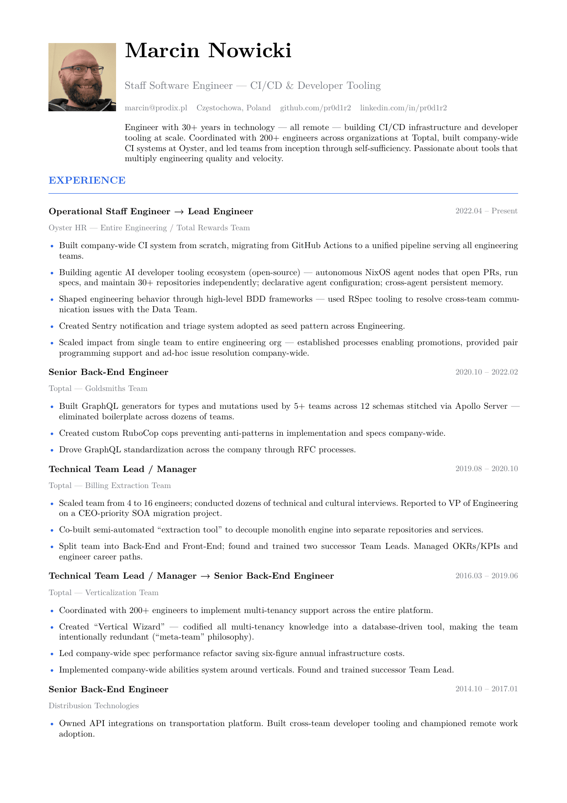

# cvium — Marcin Nowicki's CV

[](https://github.com/pr0d1r2/cvium/actions/workflows/build.yml)
[](LICENSE)
[](https://typst.app)
[](https://nixos.org)

A two-page CV for Staff / L5 CI-infrastructure and technical-leadership
roles — and a working demo of the pipeline that builds it.

[**📄 Download the PDF**](cv.pdf) · [plain text](cv.txt) · [latest release](https://github.com/pr0d1r2/cvium/releases/latest)

[](cv.pdf)

## Who

Engineer with 30+ years in technology, exclusively remote — building
CI/CD infrastructure and developer tooling at scale. Built company-wide
CI at Oyster, coordinated with 200+ engineers at Toptal, and builds
agentic AI developer tooling.

## What this repo really is

The CV is the artifact. The interesting part is that **the repo builds
and maintains itself** — a small, legible demo of the same
spec-driven, agent-operated infrastructure described in the CV.

- **Typst source** (`cv.typ`) compiles to `cv.pdf` + `cv.txt`,
  regenerated automatically on every commit.
- **Nix flake** pins every tool — typst, linters, test runner, GNU
  coreutils — so the build is identical on macOS and Linux.
- **Lefthook** runs the whole check suite as local git hooks: this is
  CI on your machine, before anything reaches GitHub.
- **GitHub Actions** mirrors that exact suite (via
  [`nix-lefthook-ci-action`](https://github.com/pr0d1r2/nix-lefthook-ci-action))
  and attaches the PDF to tagged releases — cached through
  [Cachix](https://pr0d1r2.cachix.org) so runs stay fast.
- **`SPEC.md`** is the single source of truth: goal, constraints,
  invariants, and a task backlog. Spec-driven development (SDD) keeps
  code and intent in lock-step.
- **Autonomous agents** pick open tasks from `SPEC.md`, implement them
  test-first, and open PRs that the same CI gates — the backlog
  finishing itself is the live demo.

## Quick start

Everything runs through [Nix](https://nixos.org/download) and
[just](https://github.com/casey/just). No manual installs.

```bash
nix develop          # or: direnv allow  (auto-activates the dev shell)
just                 # list every command
just build           # compile cv.typ → cv.pdf
just watch           # live recompile while editing
just photo <url>     # swap the avatar from any profile url
```

Git hooks install themselves on first shell entry; a commit runs the
full lint + format + test suite locally.

## Layout

| Path | What |
| ---- | ---- |
| `cv.typ` | CV source (Typst) |
| `cv.pdf` / `cv.txt` | generated outputs, committed |
| `flake.nix` | dev shell + tool pins + cachix |
| `lefthook.yml` | local CI: lint, format, test hooks |
| `justfile` / `scripts/` | task runner + extracted scripts |
| `SPEC.md` | spec + task backlog (the agents' work queue) |
| `agent/set/skills/` | the behavioral rules the agents follow |

## License

The **tooling** in this repo — flake, scripts, justfile, CI, skills —
is [MIT](LICENSE). The **CV content** (`cv.typ` prose, `avatar.png`,
the résumé itself) is © Marcin Nowicki and not licensed for reuse;
fork the machinery, not the biography.
